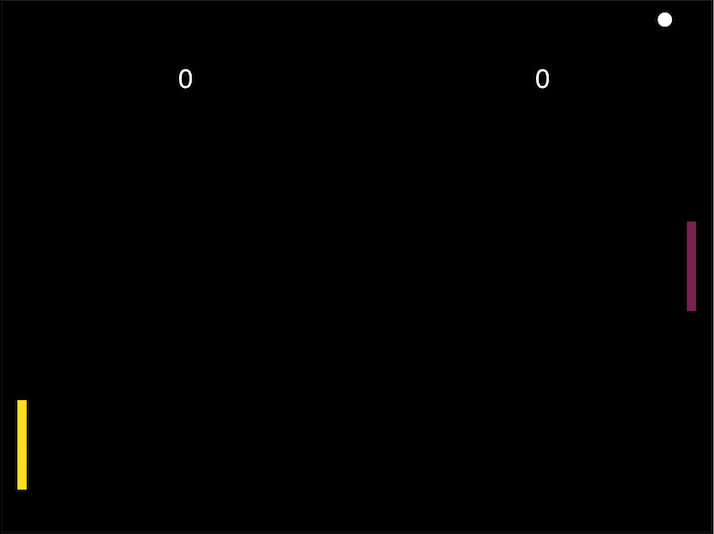

# Pong Game

This is a basic implementation of the Atari Pong game. 
<br>
> [Live Demo](https://afatihyavasi.github.io/PongGame/)<br>


<br>

<br>
 -  You can play against the computer or against your friend.<br>
 
 -  CANVAS API use this project.<br>
 
 -  PLAYER 1 - Arrow Keys. <br>
 
 -  PLAYER 2 - ```w``` and ```s```.<br>
 
 -  If you want to change the COM difficulty, the difficulty can be changed by changing the ```lvl``` ın com object.<br>
 
 - The game is over when either side scores 5 goals. If you want to change end score, change 290. line. <br>
 


